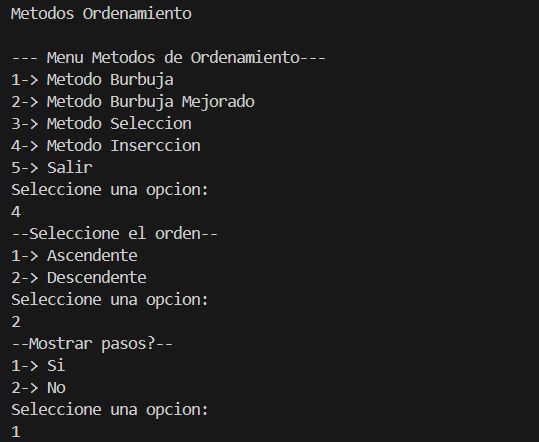

# Práctica de Algoritmos de Ordenamiento

## 📌 Información General

- **Título:** Práctica de Algoritmos de Ordenamiento
- **Asignatura:** Estructura de Datos
- **Carrera:** Computación
- **Estudiante:** [Xavier Fajardo]
- **Fecha:** [31/10/2025]
- **Profesor:** Ing. Pablo Torres

---

## 🛠️ Descripción

Este proyecto implementa y compara diferentes algoritmos de ordenamiento en Java, incluyendo:
- Método Burbuja
- Método Selección
- Método Inserción
- Método Burbuja Mejorado

Se permite elegir:
- Tipo de orden (Ascendente o Descendente).
- Visualización de pasos intermedios.
- Visualización del número de comparaciones y cambios.

---

## 🚀 Ejecución

Para ejecutar el proyecto:

1. Compila el código:
    ```bash
    javac App.java
    ```
2. Ejecuta la aplicación:
    ```bash
    java App
    ```

---

## 🧑‍💻 Ejemplo de Entrada

```plaintext
Seleccione el método de ordenamiento:
1. Burbuja
2. Selección
3. Inserción
4. Burbuja Mejorado
5. Salir

¿Desea ver los pasos? 
--Mostrar pasos?-- 
1-> Si
2-> No
Seleccione una opcion: 

¿Desea ordenar ascendentemente  descendentemente ?:
--Seleccione el orden-- 
1-> Ascendente
2-> Descendente
Seleccione una opcion:

## Capturas del Menu 


## Conclusiones de cada metodo
Durante la practica se implementaron los algoritmos de ordenamiento Burbuja, Burbuja Mejorado, Selección e Inserción en el lenguaje Java, permitiendo observar paso a paso el proceso de ordenamiento y poder elegir el orden en el que el usuario desee tanto ascendete y descendente.

A traves de la ejecución de cada método fue posible comprender las diferencias en su funcionamiento y eficiencia, especialmente en el número de comparaciones y cambios realizados.
El método Burbuja Mejorado resultó ser más eficiente que el Burbuja simple, ya que reduce las iteraciones innecesarias al detectar si el arreglo ya está ordenado.
El método Selección realiza menos cambios pero más comparaciones, mientras que Inserción se adapta mejor a arreglos parcialmente ordenados, mostrando un rendimiento superior en esos casos.

En conclusión, esta práctica permitió reforzar el conocimiento sobre los algoritmos de ordenamiento, su comportamiento interno y su eficiencia relativa, además de afianzar la importancia de estructurar el código de manera limpia y clara.

